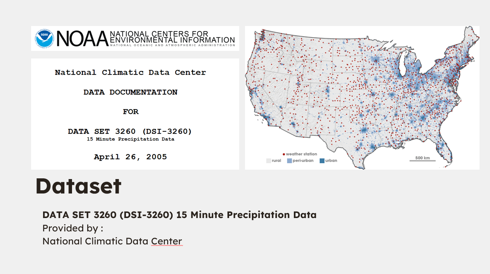

# MoistMeter - Sustainable Water Solutions

## Inspiration

The inspiration behind MoistMeter lies in the growing global water scarcity crisis. Millions are affected, and agriculture, a crucial societal backbone, is crumbling due to reduced water availability. This project aims to leverage technology to predict rainfall accurately and guide efficient rainwater harvesting, contributing to sustainable water solutions.

## What it does


MoistMeter utilizes an Artificial Intelligence model, specifically a Random Forest Regression model, to predict rainfall with precision. The system analyzes historical weather data from over 2400 weather stations, dating back to 1971. It goes beyond prediction by integrating Natural Language Processing to provide smart suggestions. Visual representation through Google's Photorealistic 3D Tiles API enhances user understanding, making it a comprehensive tool for optimizing rainwater harvesting.

## How I built it


The foundation of MoistMeter is built on a dataset derived from the National Climatic Data Center's Archives, ensuring robust predictions. The implementation involves advanced algorithms for adaptive planning and Cloudera AutoML for convenient deployment and modification. The surplus calculation feature sets MoistMeter apart, allowing organizations to plan the distribution of surplus water from regions of high rainfall to drier areas.

## Challenges I ran into

Building MoistMeter presented several challenges, including optimizing the Random Forest Regression model for real-time predictions, integrating Natural Language Processing seamlessly, and ensuring a user-friendly visual representation of complex data. Addressing these challenges required a multidisciplinary approach, combining expertise in AI, data analytics, and visualization.

## Accomplishments that I'm proud of

Despite the challenges, the successful integration of the Random Forest Regression model, Natural Language Processing, and Google's Photorealistic 3D Tiles API is a significant accomplishment. The creation of an adaptable Cloudera AutoML project adds to the project's versatility, making it a valuable tool for addressing diverse water-related challenges.

## What I learned

The development of MoistMeter provided valuable insights into optimizing AI models for practical applications, the importance of interdisciplinary collaboration, and the potential of advanced technologies in addressing critical global issues. Learning to harness historical weather data for predictive analytics and creating a user-friendly interface were key takeaways.

## What's next for MoistMeter

The journey doesn't end here. The next steps for MoistMeter include continuous refinement of prediction models, expanding the dataset for global coverage, and incorporating user feedback to enhance the system's usability. Additionally, exploring partnerships with organizations and governments for widespread adoption and furthering the commitment to a sustainable future is on the agenda. MoistMeter is not just a project; it's a step towards empowering communities and ensuring every drop counts in the fight against water scarcity.

------------------------------------------

## Dataset

### DATA SET 3260 (DSI-3260) 15 Minute Precipitation Data
Provided by :
National Climatic Data Center



## Instructions

    ├── app
    │   ├── backend      # flask app to serve predict endpoint and web interface
    │   └── frontend     # code for front end app
    ├── src
    │   └── download_data.py  # script to prepare data
    │   └── train_model.py  # script to train Random Forest Regression Model
    │   └── install_dependencies.py  # script to install dependencies
    ├── lib
    │   ├── state_resolver.py     # regional access limitation to the US
   

The following scripts are recommended as a starting point:

### Install dependencies

```shell
pip3 install -r requirements.txt
```

This repo depends on a few libraries that need to be installed.

### Download Data

```shell
python3 src/download_data.py
```

The data has already been archived on the repo for ease of access, this script mainly just extracts the data.

### Train Model

```shell
python3 src/train_model.py
```

Train the Random Forest Regression Model on the data set and store the model in the rf_model folder for usage in the web application.

### Launch the frontend app

```shell
python3 app/backend/app.py
```
This will launch a web application using a flask server
